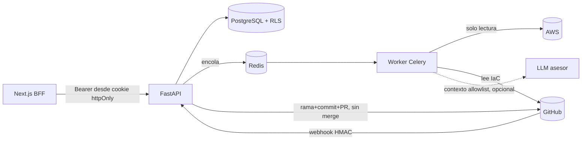

# Arquitectura

Monolito modular (ver [ADR-0001](adr/0001-modular-monolith.md)): el paquete Python `cloudcost` lo usan la API (FastAPI) y el worker (Celery).

## Pipeline de escaneo
1. Colector (red, fuera de transacciones) → recursos, métricas, costos.
2. Reglas deterministas → `Finding`; riesgo → política (`allowlist`, destructivo, producción/desconocido, confianza mínima 0.6).
3. Opcional: LLM redacta explicación y alternativas; su salida se valida y **nunca** decide ni ejecuta.
4. Upsert idempotente (`dedupe_key`); la versión sube solo ante cambio material, invalidando aprobaciones previas.

## Máquina de estados
`DETECTED → ANALYZED → PROPOSED → PENDING_APPROVAL → APPROVED|REJECTED → PR_CREATED → MERGED → DEPLOYED → VERIFIED`.
Una recomendación que la política no permite queda en `PROPOSED`. Un PR cerrado sin merge devuelve a `APPROVED`.

## Aprobación
Estándar: 1 aprobador (ADMIN/FINOPS/SRE). Reforzada (destructiva en producción/desconocido, o riesgo ALTO): 2 usuarios distintos, ≥1 ADMIN/SRE, PR en borrador, automatización bloqueada. Las aprobaciones cuentan por `recommendation_version`.

## Parche IaC
Cambia solo el literal necesario (texto exacto) y se niega si hay drift entre IaC y nube, valores no literales, `count`/`for_each` o referencias desde otros recursos. Si el original parsea con `python-hcl2`, el resultado también debe parsear.

## Verificación de ahorro
Tras `DEPLOYED`, mide el ahorro con los costes facturados (ventanas alineadas, control de uso y del resto de la cuenta) y lo compara con el **aprobado**; un valor escrito a mano queda como *declarado*. Ver [savings-methodology.md](savings-methodology.md).

## Estimado, aprobado y observado
Tres cifras separadas, nunca sumadas. Hay además un estado `EXPIRED` (el recurso o la condición dejó de existir antes de aprobar) y marcas de obsolescencia en las aprobadas.
